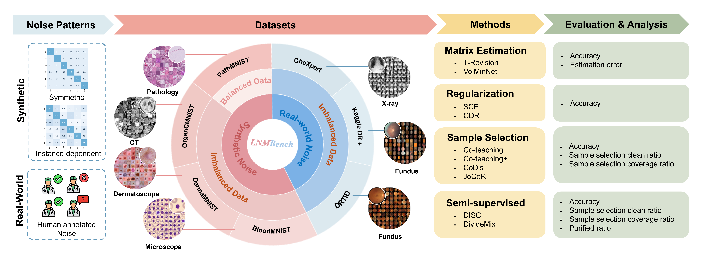
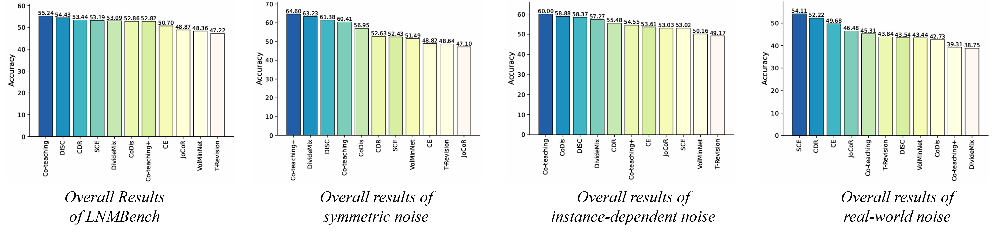

# LNMBench
Benchmarking Real-World Medical Image Classification with Noisy Labels: Challenges, Practice, and Outlook

## Introduction
LNMBench encompasses ten representative methods evaluated across 7 datasets, 6 imaging modalities, and 3 noise patterns, establishing a unified and reproducible framework for robustness evaluation under realistic conditions.


## Introduction
To obtain a stable and fair comparison, we report the average classification accuracy over the last 5 epochs for each method under three noise patterns: symmetric noise, instance-dependent noise, and real-world noise. 
Based on these results, we rank all methods according to their average performance, and further compute the mean accuracy across the three noise scenarios to provide an overall measure of robustness.
Overall, Co-teaching and DISC  achieved the highest average classification accuracy under all noise patterns. 
Co-teaching+ and DivideMix achieved the highest average classification accuracy under symmetric noise.
Co-teaching and CoDisc achieved the highest average classification accuracy under instance-dependent noise.
The noise-robust regularization methods~(SCE and CDR) achieved the highest average classification accuracy under real-world noise.


## Installation
First, clone the repo and cd into the directory:
```shell
git clone this repo.
cd LNMBench
```
Then create a conda env and install the dependencies:
```shell
conda create -n LNMBench
conda activate LNMBench
pip install -r requirements.txt
```

## 1. Prepare Datasets

### Data Download
| Domain           | Dataset         | Link                                                                                   | License        |
|------------------|-----------------|----------------------------------------------------------------------------------------|----------------|
| Pathology        | PathMNIST       | https://medmnist.com/                                                                  | CC BY 4.0      |
| Dermatology      | DermaMNIST      | https://medmnist.com/                                                                  | CC BY-NC 4.0   |
| Microscope       | BloodMNIST      | https://medmnist.com/                                                                  | CC BY 4.0      |
| Abdominal CT     | OrganCMNIST     | https://medmnist.com/                                                                  | CC BY 4.0      |
| Fundus           | DRTiD           | https://github.com/FDU-VTS/DRTiD                                                       |                |
| Fundus           | KaggleDR+       | https://arxiv.org/abs/2103.00528                                                       |                |
| Radiology        | CheXpert        | https://stanfordmlgroup.github.io/competitions/chexpert/                               | [Stanford University Dataset Research Use Agreement](https://stanfordaimi.azurewebsites.net/datasets/8cbd9ed4-2eb9-4565-affc-111cf4f7ebe2) |


## 2. Start Training
For example, traing the Co-teaching method.
```bash
python main.py --dataset pathmnist --noise_type symmetric --noise_rate 0.5 
```
### Support Methods
| Methods                | Paper                                                                                      | Link (TBD) | Offical Codes (TBD)  |
|------------------------|--------------------------------------------------------------------------------------------|------------|----------------------|
| Crossentropy           | NA                                                                                         |            |                      |
| T-Revision             | Are Anchor Points Really Indispensable in Label-Noise Learning?                            |            |                      |
| VolMinNet              | Provably End-to-end Label-noise Learning without Anchor Points                             |            |                      |
| SCE                    | Symmetric cross entropy for robust learning with noisy labels                              |            |                      |
| CDR                    | Robust early-learning: Hindering the memorization of noisy labels                          |            |                      |
| Co-teaching            | Co-teaching: Robust Training of Deep Neural Networks with Extremely Noisy Labels           |            |                      |
| Co-teaching+           | How does Disagreement Help Generalization against Label Corruption?                        |            |                      |
| CoDis                  | Combating Noisy Labels with Sample Selection  by Mining High-Discrepancy Examples          |            |                      |
| JoCoR                  | Combating Noisy Labels by Agreement: A Joint Training Method with Co-Regularization        |            |                      |
| DISC                   | DISC: Learning from Noisy Labels via Dynamic Instance-Specific Selection and  Correction   |            |                      |
| DivideMix              | DIVIDEMIX: LEARNING WITH NOISY LABELS AS  SEMI-SUPERVISED LEARNING                         |            |                      |

### ✅ Support Backbones
| Backbones        | Paper                                                                                | Status |
|------------------|--------------------------------------------------------------------------------------|---------|
| ResNet           | Deep residual learning for image recognition                                         | ✅ Done |
| ViT              | An image is worth 16x16 words: Transformers for image recognition at scale           | ⏳ In progress |
| Swin Transformer | Swin transformer: Hierarchical vision transformer using shifted windows              | ⏳ In progress |
| ConvNext         | A convnet for the 2020s                                                              | ⏳ In progress |


## Disclaimer

This repository is provided for research purposes only. The datasets used in this project are either publicly available under their respective licenses or referenced from external sources. Redistribution of data files included in this repository is not permitted unless explicitly allowed by the original dataset licenses.

### Data Usage
Please ensure that you comply with the licensing terms of the datasets before using them. The authors are not responsible for any misuse of the data. If you are using any dataset provided or linked in this repository, it is your responsibility to adhere to the license terms provided by the dataset creators.

For questions or concerns, please contact the repository maintainers.
